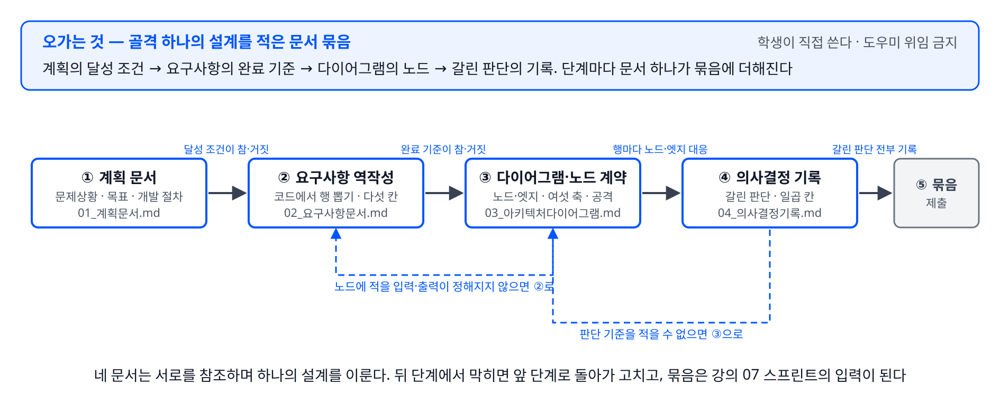

# 강의 06 · 실습 7 — 개발을 위한 기술 문서 묶음 · (1) 강사 시연

이 실습은 글쓰기 실습이며 코드를 새로 쓰지 않습니다. 학생은 실습 7부터 실습 12까지에서 직접 완주한 미니 골격 하나를 고르고, 그 골격의 설계를 문서 4종으로 적습니다. 학생은 도우미(AI 코딩 에이전트)에게 문서 작성을 맡기지 않고 직접 씁니다. 설계를 문장으로 적는 능력이 이 실습의 훈련 내용이기 때문입니다.

## 1. 문제상황

```
담당자는 코딩 에이전트에게 「사내 문의를 유형별로 나눠 처리하는 그래프를 만들어 주세요」라고 한 줄만 적어 넘겼습니다.
에이전트는 문의를 세 유형으로 분류하는 그래프를 만들어 왔습니다. 담당자가 생각한 유형은 다섯이었습니다.
담당자는 「분류가 애매하면 사람 승인을 받아야 한다」고 덧붙였고, 에이전트는 승인 대기 대신 로그를 남기는 코드로 고쳤습니다.
담당자가 완료 기준을 묻자 에이전트는 「전달받은 것이 없어 임의로 정했다」고 답했습니다.
설계가 담당자의 머릿속에만 있어서, 위임받은 쪽은 매번 되묻거나 임의로 정합니다.
```

## 2. 문제와 목표

- **문제**: 만들 것의 목표·요구사항·구조·판단 근거가 문서로 없습니다. 위임받은 쪽(사람이든 코딩 에이전트든)은 되물어야 할 것이 남아 있어 임의로 정하고, 그 결과는 담당자의 의도와 어긋납니다.
- **목표**: 학생이 직접 완주한 골격 하나를 골라, 계획 문서·요구사항 문서·아키텍처 다이어그램·의사결정 기록 네 문서로 설계를 적고, 문서만 받은 사람이 되묻지 않고 코드로 옮길 수 있는 묶음을 만듭니다.
- **목표 달성 여부의 판정 기준**: 완성한 문서 4종을 자신이 아닌 다른 사람에게 읽히고, 그 사람이 문서 밖의 질문을 하지 않고 코드로 옮기기 시작할 수 있는지 확인합니다. 질문이 나온 곳이 아직 문서로 나오지 않은 설계입니다.

## 3. 워크플로우 다이어그램



설명:
- 네 단계 사이를 오가는 대상은 작성 중인 문서 묶음입니다. 단계마다 학생은 묶음에 문서 하나를 더합니다.
- 계획 문서의 달성 조건이 요구사항 문서의 완료 기준이 되고, 요구사항 문서의 행이 다이어그램의 노드가 되며, 다이어그램에서 갈린 판단이 의사결정 기록이 됩니다.
- 뒤 단계에서 적을 것이 정해지지 않으면 앞 단계로 돌아가 고칩니다. 되돌아가는 조건은 계획 문서의 개발 절차에 적습니다.

## 4. 단계별 요구사항

1. **골격을 하나 고릅니다.** 실습 7부터 실습 12까지 중 자신이 (1) 시연본을 직접 실행하고 (2-2) 또는 (3)을 직접 작성해 완주한 골격 하나를 고릅니다. 실행해 보지 않은 골격은 완료 기준을 적을 수 없으므로 고르지 않습니다.
2. **계획 문서를 씁니다.** 문제상황(누가 겪는가·지금 어떻게 하고 있는가·무엇이 불편한가), 목표(입력·출력·달성 조건), 개발 절차 계획(문서 순서와 다음 단계로 넘어가는 조건과 앞 단계로 되돌아가는 조건), 범위에서 제외하는 것을 적습니다.
3. **요구사항 문서를 역작성합니다.** 이미 있는 코드에서 기능과 조건을 거꾸로 뽑아 기능 하나를 행 하나로 적습니다. 행마다 목적·사용자·입출력 예시·도구·완료 기준의 다섯 칸을 모두 채웁니다. 완료 기준은 코드가 참·거짓으로 판정할 수 있는 문장으로 적습니다.
4. **아키텍처 다이어그램을 그리고 노드 계약을 적습니다.** 상자는 노드, 화살표는 흐름이며 화살표 위에 상태 이름을 적습니다. 노드마다 입력·책임·출력·상태·제약·경계의 여섯 축을 표로 적습니다. 설계 공격 여덟 가지(공격 A부터 공격 H까지) 중 세 가지 이상을 골라 질문과 답을 적습니다.
5. **의사결정 기록을 옮겨 적습니다.** 골격을 만들면서 선택지가 둘 이상이었던 판단 하나 이상을 골라, 문제/맥락·선택지·판단 기준·결정·근거·결과/대가·재검토 조건의 일곱 칸으로 적습니다. 근거 칸에는 채택한 선택지보다 버린 선택지를 왜 버렸는지를 적습니다.
6. **문서 묶음으로 제출합니다.** 네 문서와 다이어그램 그림 파일을 폴더 하나에 담습니다. 폴더 이름은 `문서묶음_<골격 이름>`으로 두고, 파일 이름은 `01_계획문서.md`·`02_요구사항문서.md`·`03_아키텍처다이어그램.md`(그림 파일 포함)·`04_의사결정기록.md`로 둡니다.

## 5. 작업 골격 — 5단

골격 하나의 설계를 문서 묶음으로 옮기는 순서는 다음 다섯 단계입니다. 아래 「6. 작업 절차 — 스텝바이스텝」의 작성 칸이 이 다섯 단계와 하나씩 대응합니다.

| 단계 | 하는 일 | 산출물(파일·칸) | 대응하는 요구사항 |
|---|---|---|---|
| ① 골격 선택과 계획 문서 | 문서로 옮길 골격을 고르고 문제상황·목표·개발 절차·제외 범위를 적습니다 | `01_계획문서.md` | 1, 2 |
| ② 요구사항 역작성 | 코드에서 기능·조건을 행으로 뽑고 다섯 칸을 채웁니다 | `02_요구사항문서.md`의 표 | 3 |
| ③ 다이어그램과 노드 계약 | 노드·엣지를 그리고 여섯 축과 공격·답을 적습니다 | `03_아키텍처다이어그램.md`와 그림 파일 | 4 |
| ④ 의사결정 기록 | 갈린 판단을 일곱 칸으로 옮겨 적습니다 | `04_의사결정기록.md` | 5 |
| ⑤ 문서 묶음 제출 | 네 문서를 폴더 하나에 담아 냅니다 | `문서묶음_<골격 이름>` 폴더 | 6 |

## 6. 작업 절차 — 스텝바이스텝

### 단계 0 — 준비

작성에 필요한 것을 먼저 갖춥니다.

- 준비물은 텍스트 편집기, 자신이 완주한 골격의 노트북, 빈 폴더 `문서묶음_<골격 이름>`입니다.
- 그림 도구는 자유입니다. 손으로 그린 그림을 사진으로 찍어 넣어도 됩니다. 상자 이름, 화살표, 화살표 위의 상태 이름이 읽히면 됩니다.
- 도우미(AI 코딩 에이전트)에게 문서 4종의 작성을 맡기지 않습니다. 설계의 근거는 본인만 알고 있으므로, 도우미가 대신 쓰면 그 부분이 그럴듯한 문장으로 덮입니다.
- 아래 각 단계의 작성 칸은 강사가 「고객센터 메일 답장 워크플로우」(평가자-최적화자 골격)로 채운 예시입니다. 예시 전문은 이 폴더의 `01_계획문서.md`·`02_요구사항문서.md`·`03_아키텍처다이어그램.md`·`04_의사결정기록.md`에 있습니다. 학생은 예시 파일을 복사해 문구만 바꾸지 않고, 같은 칸을 자기 골격으로 채웁니다.

### 단계 ① — 골격 선택과 계획 문서 (요구사항 1, 2)

문서로 옮길 골격을 고르고, 계획 문서에 문제상황·목표·개발 절차·제외 범위를 적습니다.

- 문제상황은 누가 겪는가, 지금 어떻게 하고 있는가, 무엇이 불편한가의 세 항목이 문장 안에 드러나게 적습니다.
- 목표는 입력·출력·달성 조건으로 적습니다. 달성 조건은 구현을 마친 뒤 참·거짓으로 판정할 수 있어야 합니다.
- 개발 절차 계획에는 문서를 어떤 순서로 쓰는지, 다음 단계로 넘어가는 조건, 앞 단계로 되돌아가는 조건을 적습니다.

**작성 칸 — 계획 문서의 목표** (강사 시연분, `01_계획문서.md` 「2. 문제와 목표」에서 발췌)

```
입력: 고객센터 메일 본문 문자열
출력: 메일 종류(환불·배송·스팸)와 발송된 답장 본문. 스팸이면 답장 없이 종료 사유
달성 조건:
  1. 환불 문의를 넣으면 종류를 환불로 판정하고, 주문번호와 처리 기한이 든 답장을 발송한다.
  2. 광고 메일을 넣으면 종류를 스팸으로 판정하고, 답장을 만들지 않은 채 종료한다.
  3. 주문번호가 빠진 초안은 발송하지 않고 반려 사유를 붙여 다시 작성하게 한다.
  4. 다시 작성 횟수에 상한이 있고, 상한에 도달하면 발송을 중단하고 담당자 확인 대상으로 표시한다.
```

### 단계 ② — 요구사항 역작성 (요구사항 3)

이미 있는 코드에서 기능과 조건을 거꾸로 뽑아 행으로 적습니다.

- 노트북의 「4. 단계별 요구사항」과 「6. 코드 — 스텝바이스텝」의 코드를 나란히 놓고, 노드 하나·조건부 엣지 하나·상한 하나가 각각 행 하나가 되는지 확인합니다.
- 행마다 목적·사용자·입출력 예시·도구·완료 기준 다섯 칸을 채웁니다. 입출력 예시는 실제로 넣을 값과 그때 나올 값을 그대로 적습니다.
- 완료 기준은 코드가 참·거짓으로 판정할 수 있는 문장으로 적습니다. 「잘 분류한다」는 완료 기준이 아닙니다.

**작성 칸 — 요구사항 행** (강사 시연분, `02_요구사항문서.md`에서 두 행 발췌)

| # | 기능 / 조건 | 목적 | 사용자 | 입출력 예시 | 도구 | 완료 기준 |
|---|---|---|---|---|---|---|
| R4 | 초안 검사 | 주문번호와 처리 기한이 빠진 답장이 고객에게 나가는 일을 막는다 | 고객센터 팀장 | 입력: 메일 본문과 `draft` / 출력: `review="합격"` 또는 `review="반려"`와 `reject_reason` | 노드 · 모델 호출(구조화 출력) | 주문번호를 뺀 초안을 넣으면 `review` 값이 `"반려"`가 되고 `reject_reason` 칸이 채워진다 |
| R6 | 재작성 횟수 상한 | 검사와 재작성이 끝나지 않고 되풀이되는 상태를 막는다 | 고객센터 팀장 | 입력: `attempt=3` / 출력: 발송하지 않고 `status="담당자 확인 필요"` | 조건부 엣지 · 상태 칸 `attempt` | 항상 반려를 돌려주는 검사로 실행하면 초안 작성 노드가 3회까지만 실행되고 종료된다 |

### 단계 ③ — 다이어그램과 노드 계약 (요구사항 4)

노드와 엣지를 그리고, 노드마다 여섯 축을 적고, 설계를 공격합니다.

- 상자는 노드, 화살표는 흐름입니다. 화살표 위에 앞 단계에서 다음 단계로 넘어가는 상태의 이름을 적습니다.
- 노드마다 입력·책임·출력·상태·제약·경계 여섯 축을 표로 적습니다. 여섯 축이 다 채워지면 코드로 옮길 때 다시 물어볼 것이 남지 않습니다.
- 설계 공격 여덟 가지 중 세 가지 이상을 골라 질문과 답을 적습니다. 문제가 나오면 다이어그램 안에서만 고치지 않고 요구사항 행과 노드 제약으로 되돌려 고칩니다.

**작성 칸 — 노드 계약과 공격** (강사 시연분, `03_아키텍처다이어그램.md`에서 발췌)

| 노드 | 입력 | 책임 | 출력 | 상태 | 제약 | 경계 |
|---|---|---|---|---|---|---|
| evaluate | 상태의 `email`, `draft`, `attempt` | 초안에 주문번호와 처리 기한이 있는지 판정하고, 다음에 갈 곳을 정한다 | `review`, `reject_reason` | `review`와 `reject_reason` 칸을 쓴다. `draft` 칸은 고치지 않는다 | 판정 값은 `"합격"`과 `"반려"` 둘만 쓴다. `attempt`가 3이면 반려여도 되돌리지 않는다 | 초안을 직접 고치지 않는다. 판정과 사유만 돌려준다 |

| 공격 | 질문 | 답 |
|---|---|---|
| 공격 A | evaluate 노드를 삭제해도 목표가 달성되는가 | 달성되지 않습니다. 달성 조건 3번이 주문번호가 빠진 초안을 걸러 내는 것이므로 evaluate 노드가 없으면 조건 3번을 확인할 방법이 없습니다 |
| 공격 D | `attempt` 상한이 지켜지지 않으면 무슨 일이 벌어지는가 | draft와 evaluate가 끝나지 않고 되풀이되며 호출 비용이 계속 발생합니다. 대응으로 `attempt` 증가를 draft 노드 안에 두어 초안 작성마다 반드시 늘어나게 합니다 |

### 단계 ④ — 의사결정 기록 (요구사항 5)

골격을 만들면서 갈렸던 판단을 일곱 칸으로 옮겨 적습니다.

- 이미 지나간 판단을 되짚어 적습니다. 선택지가 둘 이상이었던 판단이 기록 대상입니다.
- 근거 칸은 채택한 선택지를 설명하는 칸이 아니라, 버린 선택지를 왜 버렸는지 설명하는 칸입니다.
- 재검토 조건에는 어떤 조건이 바뀌면 결정을 다시 봐야 하는지를 적습니다.

**작성 칸 — 결정 하나** (강사 시연분, `04_의사결정기록.md` 결정 2에서 발췌)

```
결정 2 — 되돌림 루프를 언제 끝내는가
1. 문제 / 맥락: 평가 노드가 초안 노드로 되돌리는 루프가 생겼다. 종료 조건이 없으면 끝나지 않는다.
2. 선택지: ① 합격까지 되돌린다(횟수 제한 없음) ② 초안 작성 횟수 상한(3)에서 끝낸다 ③ 60초가 지나면 끝낸다
3. 판단 기준: ㉠ 코드가 참·거짓으로 판정할 수 있을 것 ㉡ 호출 비용 상한을 메일 한 통 단위로 예측할 수 있을 것 ㉢ 종료 시 담당자가 후속 조치를 알 것
4. 결정: 선택지 ②. 상한 3, 도달하면 발송하지 않고 status에 "담당자 확인 필요"를 쓰고 종료
5. 근거: ①은 ㉡을 못 지킨다(호출이 무한히 는다). ③은 ㉠은 지키지만 ㉡을 못 지킨다(60초 안의 호출 수가 응답 속도에 따라 다르다).
6. 결과 / 대가: 얻는 것 = 호출 횟수 상한 고정. 치르는 것 = 세 번째 초안도 반려된 메일은 담당자에게 넘어간다.
7. 재검토 조건: 상한 도달 건이 전체의 10%를 넘으면 상한 값과 초안 노드 지침을 함께 재검토
```

### 단계 ⑤ — 문서 묶음 제출 (요구사항 6)

네 문서를 폴더 하나에 담아 냅니다.

- 폴더 이름은 `문서묶음_<골격 이름>`, 파일은 `01_계획문서.md`·`02_요구사항문서.md`·`03_아키텍처다이어그램.md`(그림 파일 포함)·`04_의사결정기록.md`입니다.
- 이 묶음은 강의 07 종합 구현 스프린트의 입력이 됩니다. 리뷰에서 지적된 곳을 고친 뒤 가져갑니다.

**작성 칸 — 폴더 구성** (강사 시연분)

```
문서묶음_고객센터메일답장/
  01_계획문서.md
  02_요구사항문서.md
  03_아키텍처다이어그램.md
  03_아키텍처다이어그램.svg     <- 그림 파일 (사진이면 .jpg)
  04_의사결정기록.md
```

## 7. 제출물 확인

완성한 문서 묶음에 다음 일곱 가지가 들어 있는지 확인합니다.

1. 계획 문서의 문제상황에 누가 겪는가·지금 어떻게 하고 있는가·무엇이 불편한가 세 항목이 모두 드러나 있습니다.
2. 계획 문서의 달성 조건이 참·거짓으로 판정할 수 있는 문장이고, 그 조건이 요구사항 문서의 완료 기준에 그대로 이어져 있습니다.
3. 요구사항 문서의 모든 행에 목적·사용자·입출력 예시·도구·완료 기준 다섯 칸이 채워져 있습니다. 빈 칸이 있으면 아직 완료가 아닙니다.
4. 요구사항 문서의 모든 행이 다이어그램의 노드 또는 엣지에 대응하고, 노드마다 여섯 축이 적혀 있습니다.
5. 설계 공격 세 가지 이상에 질문과 답이 있고, 답에서 나온 수정이 요구사항 행이나 노드 제약에 반영되어 있습니다.
6. 의사결정 기록의 근거 칸이 버린 선택지를 설명하고, 재검토 조건이 적혀 있습니다.
7. 네 문서와 그림 파일이 폴더 하나에 정한 이름으로 들어 있습니다.

마지막으로 다른 사람 한 명에게 문서 묶음을 읽히고, 문서 밖의 질문 없이 코드로 옮기기 시작할 수 있는지 확인합니다.

## 8. 정리

- 학생이 이 실습에서 만든 것은 문서 4종의 묶음이며, 계획 문서·요구사항 문서·아키텍처 다이어그램·의사결정 기록으로 이루어집니다.
- 네 문서는 서로를 참조하며 하나의 설계를 이룹니다. 계획의 달성 조건이 요구사항의 완료 기준이 되고, 요구사항 행이 다이어그램의 노드가 되며, 다이어그램에서 갈린 판단이 의사결정 기록이 됩니다.
- 완료 기준은 코드가 참·거짓으로 판정할 수 있는 문장으로 적습니다. 노드마다 여섯 축을 채우면 코드로 옮길 때 되물을 것이 남지 않습니다.
- 설계 공격에서 나온 문제는 다이어그램 안에서만 고치지 않고 요구사항으로 되돌려 고칩니다. 요구사항 분석과 아키텍처 설계는 서로를 반복해서 수정합니다.
- 이렇게 적어 낸 문서 묶음은 사람에게도 코딩 에이전트에게도 그대로 넘길 수 있는 입력이 되며, 강의 07 종합 구현 스프린트에서 코드로 이어집니다.
